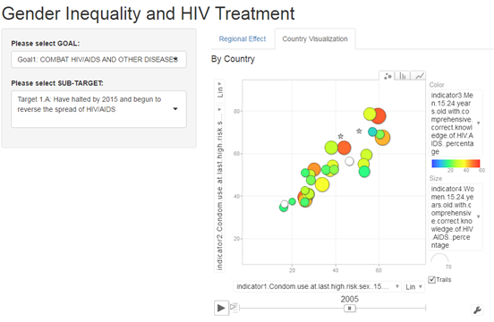

## Background

The Millennium Development Goals (MDGs) are the eight international development goals that were established following the Millennium Summit of the United Nations in 2000, following the adoption of the United Nations Millennium Declaration. All 189 United Nations member states at the time (there are 193 currently), and at least 23 international organizations, committed to help achieve the eight Millennium Development Goals by 2015.

The goal of the presentation is to introduce the Shiny APP which focuses on only two of the goals about gender problem and show how to use this APP.

The application "Millennium Development Goals (MDGs)" is deployed here: https://xita20.shinyapps.io/ShinyAPP/

The dataset used and source code for ui.R and server.R files can be found here: https://github.com/xita20/DataProduct-Shiny

--- .class #id

Goal 1: Combat HIV/AIDS, malaria, and other diseases
* Target A: Have halted by 2015 and begun to reverse the spread of HIV/AIDS
* Target B: Achieve, by 2010, universal access to treatment for HIV/AIDS for all those who need it
* Target C: Have halted by 2015 and begun to reverse the incidence of malaria and other major diseases

Goal 2: Promote gender equality and empower women
* Target A: Eliminate gender disparity in primary and secondary education preferably by 2005, and at all levels by 2015

--- .class #id

## Shiny Application Functionality 

You can view the country tab by three types of graphs - Scatter, Column, or line. For each of the combination of goals and targets, we have different indicators for you to compare between countries, or the same countries over time (y axis). You can change the order of the countries shown in the graphs by different dimensions in x axis.

You can choose speicific country to focus on, and have different colour/size options for countries.

The region tab has two parts. The bottom chart shows the indicator for a combination of goal and target for Year 1990, Year 2000, and Year 2010. You can compare the same region change over decades, or compare different regions during the same time period.

The top geographic map ranks different regions on a scale from 0 to 5 based on the caculated result in the bottom chart.

---  .class #id

## Shiny APP Demo - Country Visualization (Example)

<!-- Limit image width and height -->

 
<!-- Center image on slide -->

---  .class #id

## Shiny APP Demo - Regional Effect (Example)

